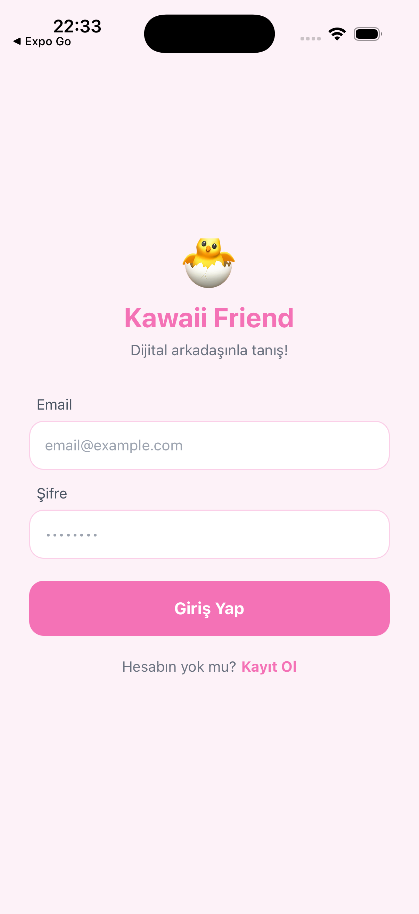
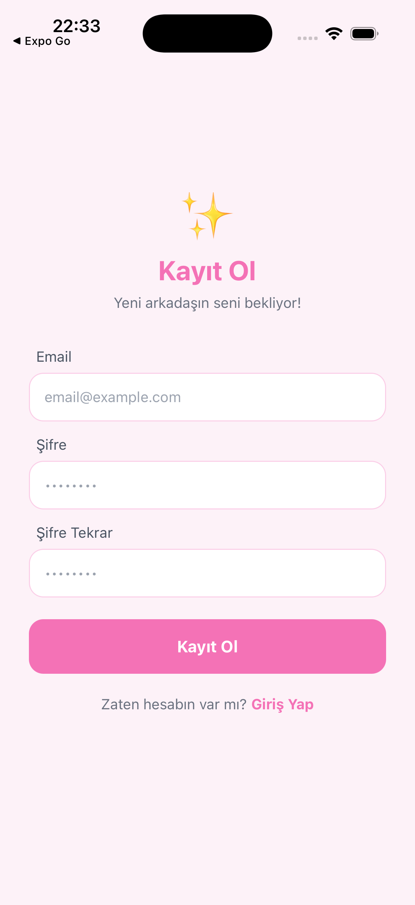
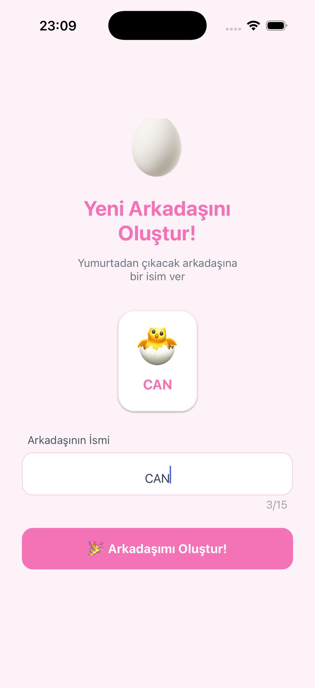
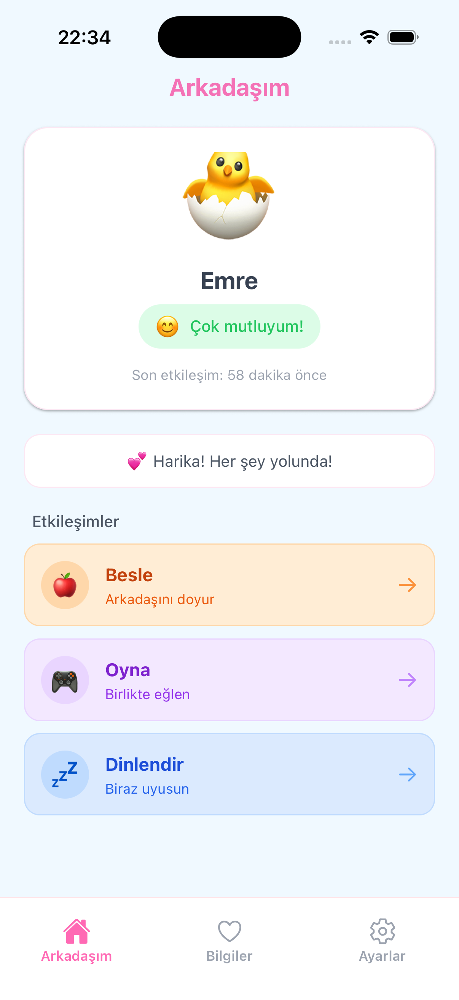
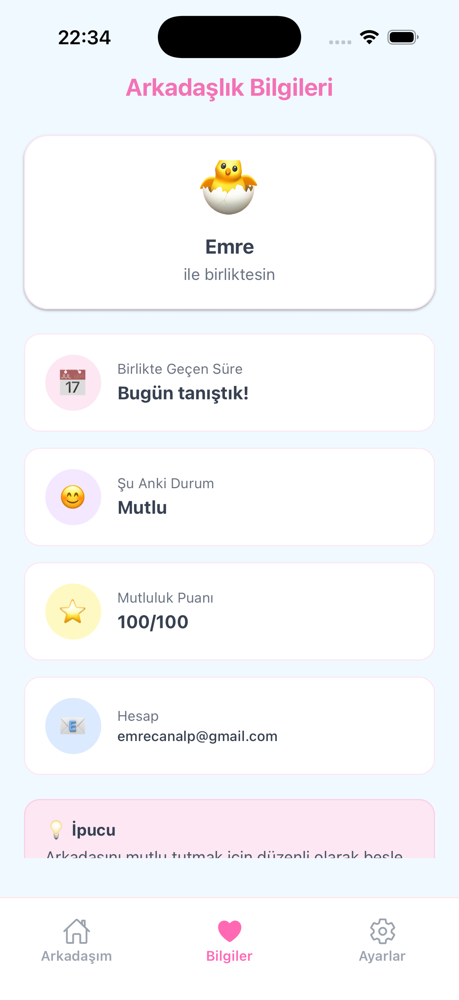
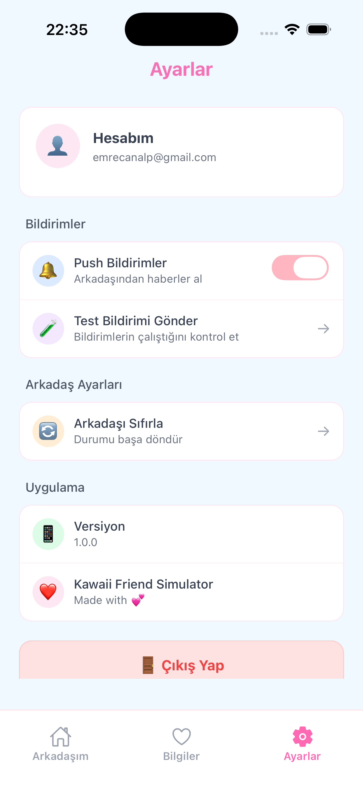
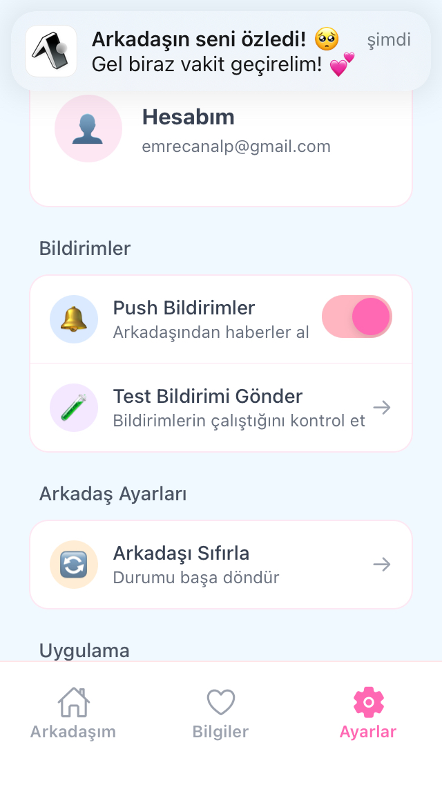

# 🐣 Kawaii Friend Simulator

Dijital arkadaşınızı oluşturun ve onunla etkileşime geçin! Tamagotchi/Tomodachi benzeri bir virtual companion uygulaması.


---

## 📱 Ekran Görüntüleri

| Login | Kayıt | Arkadaş Oluştur |
|-------|-------|-----------------|
|  |  |  |

| Ana Ekran | Bilgiler | Ayarlar |
|-----------|----------|---------|
|  |  |  |

| Push Notification |
|-------------------|
|  |

---

## ✅ Karşılanan Gereksinimler

### 🛠️ Proje Yapısı

| Gereksinim | Durum |
|------------|-------|
| Expo (managed workflow) | ✅ |
| React Native | ✅ |
| TypeScript | ✅ |
| NativeWind (stil için) | ✅ |
| Firebase Authentication | ✅ |
| Firebase Firestore | ✅ |
| Expo Notifications | ✅ |

### 🔐 Authentication

| Gereksinim | Durum |
|------------|-------|
| Email/Password ile giriş | ✅ |
| Email/Password ile kayıt | ✅ |
| Login olmadan uygulama kullanılamaz | ✅ |
| İlk girişte arkadaş oluşturma | ✅ |

### 🐣 Home Screen - My Friend

| Gereksinim | Durum |
|------------|-------|
| Karakter görseli | ✅ |
| Karakter adı | ✅ |
| Karakterin mevcut durumu (state) | ✅ |

### 🎮 Friend States

| Gereksinim | Durum |
|------------|-------|
| Happy (Mutlu) state | ✅ |
| Hungry (Aç) state | ✅ |
| Tired (Yorgun) state | ✅ |
| Bored (Sıkılmış) state | ✅ |
| State Firestore'da tutuluyor | ✅ |

### 🕹️ Interactions (En az 3)

| Gereksinim | Durum |
|------------|-------|
| 🍎 Feed (Besle) | ✅ |
| 🎮 Play (Oyna) | ✅ |
| 💤 Rest (Dinlendir) | ✅ |
| Etkileşim state'i değiştiriyor | ✅ |
| Firestore'a kaydediliyor | ✅ |
| UI'da anında güncelleniyor | ✅ |

### 🔔 Push Notifications

| Gereksinim | Durum |
|------------|-------|
| Expo Notifications kullanımı | ✅ |
| Kullanıcıdan izin alma | ✅ |
| Ayarlardan açma/kapama | ✅ |
| Test bildirimi gönderme | ✅ |

### ⚙️ Settings Screen

| Gereksinim | Durum |
|------------|-------|
| Push Notification Aç/Kapat | ✅ |
| Karakteri sıfırla | ✅ |
| Çıkış yap | ✅ |

### 🧭 Navigation

| Gereksinim | Durum |
|------------|-------|
| Bottom Tab Navigation | ✅ |
| Home tab | ✅ |
| History/Bilgiler tab | ✅ |
| Settings tab | ✅ |

### 🎨 UI/UX

| Gereksinim | Durum |
|------------|-------|
| NativeWind kullanımı | ✅ |
| Kawaii/pastel tema | ✅ |
| Yuvarlatılmış köşeler | ✅ |
| Sert/agresif renk yok | ✅ |

---

## ✨ Özellikler

- 🔐 **Firebase Authentication** - Email/Password ile güvenli giriş
- 🐣 **Virtual Companion** - Kendi dijital arkadaşınızı oluşturun
- 🎮 **3 Etkileşim** - Besle, Oyna, Dinlendir
- 📊 **4 Durum** - Happy, Hungry, Tired, Bored
- 🔔 **Push Notifications** - Arkadaşınızdan bildirimler alın
- 💾 **Firestore** - Gerçek zamanlı veri senkronizasyonu
- 🎨 **Kawaii UI** - Pastel renkler ve yuvarlatılmış köşeler

---

## 🛠️ Kullanılan Teknolojiler

| Alan | Teknoloji |
|------|-----------|
| Framework | Expo (Managed Workflow) |
| UI | React Native |
| Language | TypeScript |
| Styling | NativeWind (Tailwind CSS) |
| Auth | Firebase Authentication |
| Database | Firebase Firestore |
| Notifications | Expo Notifications |
| Navigation | React Navigation (Bottom Tabs) |

---

## 📦 Kurulum Adımları

### 1. Projeyi Klonla
```bash
git clone https://github.com/emrecanalp/gorev-20-kawaii-friend-simulator.git
cd kawaii-friend-simulator
```

### 2. Bağımlılıkları Yükle
```bash
npm install
```

### 3. Firebase Konfigürasyonu

`src/config/firebase.ts` dosyasında kendi Firebase bilgilerinizi girin:
```typescript
const firebaseConfig = {
  apiKey: "YOUR_API_KEY",
  authDomain: "YOUR_AUTH_DOMAIN",
  projectId: "YOUR_PROJECT_ID",
  storageBucket: "YOUR_STORAGE_BUCKET",
  messagingSenderId: "YOUR_MESSAGING_SENDER_ID",
  appId: "YOUR_APP_ID"
};
```

### 4. Uygulamayı Başlat
```bash
npx expo start
```

### 5. Test Et

- **Telefon:** Expo Go uygulamasını indir ve QR kodu tara
- **iOS Simulator:** Terminalde `i` tuşuna bas
- **Android Emulator:** Terminalde `a` tuşuna bas

---

## 🎮 Uygulama Kullanımı

### Friend States (Durumlar)

| Durum | Emoji | Açıklama |
|-------|-------|----------|
| Happy | 😊 | Mutlu ve sağlıklı |
| Hungry | 🥺 | Yemek istiyor |
| Tired | 😴 | Dinlenmeye ihtiyacı var |
| Bored | 😐 | Eğlence istiyor |

### Interactions (Etkileşimler)

| Aksiyon | Emoji | Etki |
|---------|-------|------|
| Besle | 🍎 | Hungry → Happy |
| Oyna | 🎮 | Bored → Happy |
| Dinlendir | 💤 | Tired → Happy |

---

## ☁️ Firestore Data Model
```
users (collection)
  └── {uid} (document)
      ├── uid: string
      ├── email: string
      ├── friendName: string
      ├── friendState: "hungry" | "tired" | "happy" | "bored"
      ├── lastInteraction: timestamp
      ├── happinessScore: number
      └── createdAt: timestamp
```

---

## 📁 Proje Yapısı
```
kawaii-friend-simulator/
├── App.tsx
├── global.css
├── tailwind.config.js
├── metro.config.js
├── babel.config.js
├── app.json
├── src/
│   ├── config/
│   │   └── firebase.ts
│   ├── context/
│   │   ├── AuthContext.tsx
│   │   └── NotificationContext.tsx
│   ├── screens/
│   │   ├── LoginScreen.tsx
│   │   ├── RegisterScreen.tsx
│   │   ├── CreateFriendScreen.tsx
│   │   ├── HomeScreen.tsx
│   │   ├── HistoryScreen.tsx
│   │   ├── SettingsScreen.tsx
│   │   └── index.ts
│   ├── components/
│   │   └── Navigation.tsx
│   └── types/
│       └── index.ts
├── assets/
└── screenshots/
```

---

## 👨‍💻 Geliştirici

**İsim:** [Emre Can]

**Tarih:** 2025

---

## 📄 Lisans

Bu proje eğitim amaçlı geliştirilmiştir.

---
